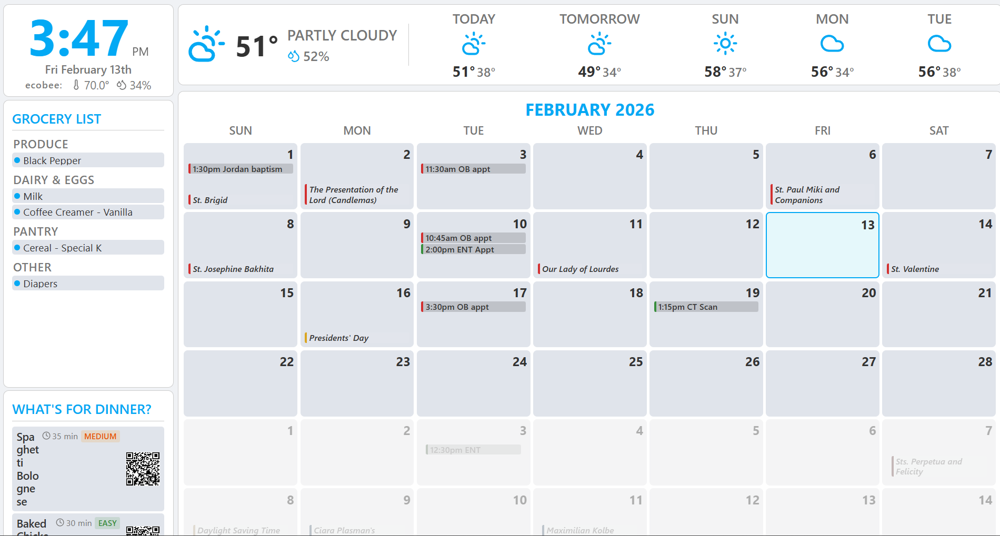

# HAPi Dashboard

A kiosk-style dashboard for Home Assistant, designed for a dedicated display. Intended for low-power hardware like a Raspberry Pi 3 Model B (1GB RAM) — though this is not yet tested in production. No backend server — the browser calls the HA REST API directly.



## Features

### Clock & Indoor Climate
Real-time clock with date display. Shows indoor temperature and humidity from an Ecobee thermostat (or any `climate` entity).

### Weather & Forecast
Current conditions, temperature, humidity, and precipitation probability. 5-day forecast with high/low temps and weather icons. Data from any HA `weather` entity.

### Calendar
Full month grid view with color-coded events from multiple Google Calendar (or other) sources. Supports timed events, all-day events, and multi-day events. Events are color-coded per calendar with configurable priority for display in tight cells.

### Grocery List
Displays your HA shopping list (`todo.shopping_list`) organized by category (Produce, Dairy, Meat, Pantry, etc.). Items are auto-categorized by keyword matching. Completed items show as struck-through.

Works great with the companion [GroceryList](https://github.com/JebediahMilkshake/GroceryList) app — a mobile-friendly NFC-triggered interface for adding/removing items from the same HA shopping list. Add items from your phone, see them appear on the dashboard in real time via WebSocket.

### Dinner Suggestions (AI-powered)
The "What's for Dinner?" panel displays 3 meal suggestions with estimated cook time and difficulty rating (easy/medium/hard). Can leverage a local LLM via [Ollama](https://ollama.ai) (e.g., llama3.1) or a cloud-based model with an API key — just point `LLM_URL` at any OpenAI-compatible endpoint.

- Suggestions are persisted to a HA sensor entity (`sensor.dinner_suggestions`) so they survive page reloads
- Auto-refreshes when suggestions are older than 24 hours

### Dark/Light Theme
Controlled by an HA `input_boolean` toggle. Switches between dark and light themes with smooth CSS transitions.

### Real-time Updates
WebSocket connection to HA pushes instant updates when entities change — no polling delay for calendar edits, shopping list changes, or theme toggles. Polling runs as a fallback safety net.

## Architecture

```
Pi Browser  ──fetch──>  Home Assistant REST API  (weather, calendars, shopping, theme)
            ──WebSocket──>  HA state_changed events  (real-time push updates)
            ──fetch──>  LLM API     (dinner suggestions — Ollama local or cloud)
```

All logic runs client-side. Four static files, no build step, no framework.

```
HAPi-Dashboard/
├── index.html      # Dashboard shell — loads config, icons, and JS
├── config.js       # All configuration (HA connection, entities, calendars, Ollama)
├── dashboard.js    # Application logic (API calls, caching, DOM rendering)
└── style.css       # Dark/light theme styles using CSS custom properties
```

## Setup

### Prerequisites
- Home Assistant instance with REST API access
- Long-lived access token (HA Profile > Security > Long-Lived Access Tokens)
- Weather integration configured (e.g., `weather.forecast_home`)
- Calendar integrations (Google Calendar, etc.)
- For dinner suggestions: an LLM with an Ollama-compatible API — either [Ollama](https://ollama.ai) running locally (e.g., `ollama pull llama3.1`) or a cloud provider with a compatible endpoint

### 1. Configure

Edit `config.js` with your settings:

```js
const CONFIG = {
    HA_URL: "",              // empty string = same origin (served from HA's www folder)
    HA_TOKEN: "your-long-lived-access-token",

    WEATHER_ENTITY: "weather.forecast_home",
    THERMOSTAT_ENTITY: "climate.my_ecobee",

    CALENDARS: [
        {
            entity: "calendar.your_calendar",
            name: "My Calendar",
            color_dark: "#51cf66",
            color_light: "#388E3C",
            priority: 1
        }
        // Add more calendars as needed
    ],

    THEME_ENTITY: "input_boolean.calendar_dashboard_dark_mode",
    SHOPPING_LIST_ENTITY: "todo.shopping_list",

    // LLM (for dinner suggestions — Ollama, or any compatible API)
    LLM_URL: "http://your-llm-host:11434",
    LLM_MODEL: "llama3.1",
    DINNER_REFRESH_HOURS: 24,
};
```

### 2. HA Helpers (optional)

Create these in HA (Settings > Devices > Helpers) for full functionality:
- `input_boolean.calendar_dashboard_dark_mode` — theme toggle
- `input_boolean.calendar_dashboard_blank_screen` — screen blank control

The dinner suggestions sensor (`sensor.dinner_suggestions`) is created automatically by the REST API on first use — no manual setup needed.

### 3. Deploy

Copy the files to your Home Assistant `www` directory:

```bash
cp index.html config.js dashboard.js style.css /config/www/hapi-dashboard/
```

Then access the dashboard at:
```
http://<your-ha-ip>:8123/local/hapi-dashboard/index.html
```

### 4. LLM CORS (for dinner suggestions)

If your LLM runs on a different host than HA, the browser needs CORS headers. For Ollama specifically:

```bash
# On the Ollama host, edit the systemd service:
sudo systemctl edit ollama

# Add:
[Service]
Environment="OLLAMA_ORIGINS=*"

# Restart:
sudo systemctl restart ollama
```

### 5. Kiosk Mode (Raspberry Pi)

For a dedicated display, launch a browser in kiosk mode pointed at the dashboard URL. The CSS hides the cursor and disables scrolling automatically. A systemd service can auto-start the browser on boot.

## Configuration Reference

| Key | Description | Default |
|-----|-------------|---------|
| `HA_URL` | HA base URL (empty = same origin) | `""` |
| `HA_TOKEN` | Long-lived access token | required |
| `WEATHER_ENTITY` | Weather entity ID | `weather.forecast_home` |
| `THERMOSTAT_ENTITY` | Climate entity for indoor temp/humidity | `climate.my_ecobee` |
| `CALENDARS` | Array of calendar configs with entity, name, colors, priority | — |
| `THEME_ENTITY` | `input_boolean` for dark/light toggle | — |
| `SHOPPING_LIST_ENTITY` | Todo entity for grocery list | `todo.shopping_list` |
| `GROCERY_CATEGORIES` | Keyword-to-category mapping rules | built-in |
| `GROCERY_CATEGORY_ORDER` | Display order for grocery categories | built-in |
| `LLM_URL` | LLM API base URL (Ollama or compatible) | — |
| `LLM_MODEL` | Model name | `llama3.1` |
| `DINNER_REFRESH_HOURS` | Hours before auto-refreshing suggestions | `24` |
| `DINNER_ENTITY` | HA sensor for persisting dinner data | `sensor.dinner_suggestions` |
| `NOTIFY_DEVICES` | Mobile devices for push notifications (future use) | — |
| `CACHE_DURATION` | Per-data-type cache TTLs in seconds | weather: 60, theme: 300, forecast: 300, shopping: 30 |

## Future Ideas

- Modular panel system with a GUI configurator — enable/disable panels, rearrange layout, swap components without editing code
- Voice assistant integration (HA Assist satellite) for triggering dinner suggestion refresh and pushing recipe links to phones
- Additional panel types (e.g., traffic/commute, package tracking, family photo rotation)

## Branches

- **`ha-static`** — Current: static JS dashboard served from HA's www folder
- **`flask-backend`** — Original Python/Flask version with backend proxy
- **`main`** — Common ancestor
